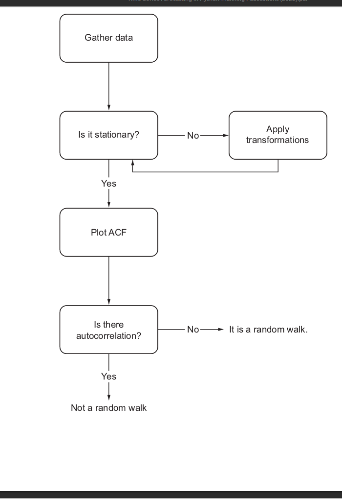

# Identify a *Random Walk* in time series
The purpose of this reppository is learning to identify a random walk in a time series analysis. In order to do that, the definition and the process to identify this sort of series is presented. The next diagram shows the general process:

1. Gather data: here we'll create a random walk with uniform random numbers.
2. Stationary: an statistical tesy will be applied, it's called *Augmented Dickey-Fuller (ADF) test*.
3. Transformations: the difference transformation will be used.
4. ACF and autocorrelation: it means *Autocorrelation Function*. This plot will generate the correlation coefficients of the data. And they are used to evaluate correlation.

Bibliography:
- Peixeiro, M. (2022). Time Series Forecasting in Python (1st ed., Chapter 3, pp. 30-60). Manning Publications.
